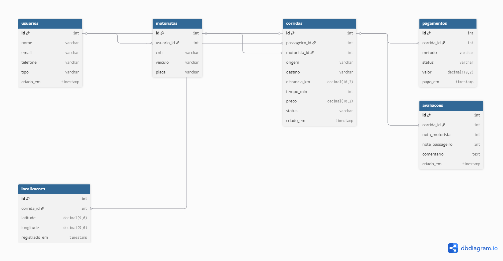

# 🗄️ Modelagem do Banco de Dados

Este projeto simula uma plataforma de mobilidade (estilo Uber), com foco em modelagem relacional, integridade de dados e análise futura.

---

## 📌 Visão Geral

O banco foi estruturado para representar:

* 👤 Usuários (passageiros e motoristas)
* 🚗 Corridas
* 💳 Pagamentos
* ⭐ Avaliações
* 📍 Localizações (rastreamento)

---

## 🧩 Diagrama Entidade-Relacionamento (DER)

---

## 👤 Tabela: usuarios

Armazena todos os usuários da plataforma, incluindo passageiros e motoristas.

| Coluna    | Tipo      | Descrição                   |
| --------- | --------- | --------------------------- |
| id        | int       | Identificador único (PK)    |
| nome      | varchar   | Nome do usuário             |
| email     | varchar   | Email único                 |
| telefone  | varchar   | Contato                     |
| tipo      | varchar   | 'passageiro' ou 'motorista' |
| criado_em | timestamp | Data de criação             |

---

## 🚗 Tabela: motoristas

Extensão da tabela `usuarios`, contendo informações específicas de motoristas.

| Coluna     | Tipo    | Descrição                |
| ---------- | ------- | ------------------------ |
| id         | int     | Identificador único (PK) |
| usuario_id | int     | FK para usuarios.id      |
| cnh        | varchar | Documento do motorista   |
| veiculo    | varchar | Modelo do veículo        |
| placa      | varchar | Placa do veículo (única) |

---

## 🚕 Tabela: corridas

Representa as corridas realizadas na plataforma.

| Coluna        | Tipo          | Descrição                |
| ------------- | ------------- | ------------------------ |
| id            | int           | Identificador único (PK) |
| passageiro_id | int           | FK para usuarios.id      |
| motorista_id  | int           | FK para motoristas.id    |
| origem        | varchar       | Local de início          |
| destino       | varchar       | Local de destino         |
| distancia_km  | decimal(10,2) | Distância percorrida     |
| tempo_min     | int           | Duração em minutos       |
| preco         | decimal(10,2) | Valor da corrida         |
| status        | varchar       | Status da corrida        |
| criado_em     | timestamp     | Data de criação          |

---

## 💳 Tabela: pagamentos

Controla os pagamentos das corridas.

| Coluna     | Tipo          | Descrição                   |
| ---------- | ------------- | --------------------------- |
| id         | int           | Identificador único (PK)    |
| corrida_id | int           | FK (única) para corridas.id |
| metodo     | varchar       | Forma de pagamento          |
| status     | varchar       | Status do pagamento         |
| valor      | decimal(10,2) | Valor pago                  |
| pago_em    | timestamp     | Data do pagamento           |

📌 **Regra:** 1 corrida possui apenas 1 pagamento (relacionamento 1:1)

---

## ⭐ Tabela: avaliacoes

Armazena avaliações entre passageiros e motoristas.

| Coluna          | Tipo      | Descrição                   |
| --------------- | --------- | --------------------------- |
| id              | int       | Identificador único (PK)    |
| corrida_id      | int       | FK (única) para corridas.id |
| nota_motorista  | int       | Nota dada ao motorista      |
| nota_passageiro | int       | Nota dada ao passageiro     |
| comentario      | text      | Feedback textual            |
| criado_em       | timestamp | Data da avaliação           |

📌 **Regra:** 1 corrida possui apenas 1 avaliação (relacionamento 1:1)

---

## 📍 Tabela: localizacoes

Armazena dados de localização ao longo da corrida.

| Coluna        | Tipo         | Descrição                |
| ------------- | ------------ | ------------------------ |
| id            | int          | Identificador único (PK) |
| corrida_id    | int          | FK para corridas.id      |
| latitude      | decimal(9,6) | Coordenada geográfica    |
| longitude     | decimal(9,6) | Coordenada geográfica    |
| registrado_em | timestamp    | Momento do registro      |

📌 Permite análise de trajetos e rastreamento em tempo real.

---

## 🔗 Relacionamentos

* usuarios → motoristas (1:1)
* usuarios → corridas (1:N)
* motoristas → corridas (1:N)
* corridas → pagamentos (1:1)
* corridas → avaliacoes (1:1)
* corridas → localizacoes (1:N)

---

## 🧠 Decisões de Modelagem

* Uso de tabela única `usuarios` para evitar duplicação
* Separação de `motoristas` como extensão (normalização)
* Uso de `UNIQUE` para garantir relações 1:1
* Tipos `DECIMAL` para precisão financeira
* Estrutura preparada para análises futuras (BI)

---

## 🚀 Possíveis Evoluções

* Uso de ENUM para status
* Índices para performance
* Geolocalização avançada (PostGIS)
* Histórico de status de corridas
* Sistema de promoções/descontos

---
